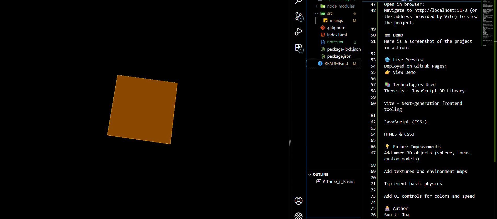

# Three_js_Basics

Rotating Cube 🎲
This is a beginner-friendly Three.js project that renders a rotating cube with lighting, orbit controls, and edge highlights. It demonstrates the fundamentals of WebGL rendering using the Three.js library.

🚀 Features
3D rotating cube built with BoxGeometry

Custom material and edge outlines

PointLight and AmbientLight for a realistic effect

Interactive camera with OrbitControls

Responsive canvas that adjusts on window resize

📂 Project Structure
.
├── index.html       # Entry HTML file
├── src/main.js          # Core Three.js logic
├── package.json     # Dependencies & scripts
└── README.md        # Project documentation
🛠️ Installation & Setup
Clone the repository:

Bash

git clone https://github.com/Sjsuniti/Three_js_Basics.git
cd Three_js_Basics
Install dependencies:
This project uses Vite as a build tool, which is included in the dependencies.

Bash

npm install
Start the development server:
Vite will start a local server and enable hot-reloading.

Bash

npm run dev
Alternatively, you can use a local server like http-server if you prefer:

Bash

npx http-server .
Open in browser:
Navigate to http://localhost:5173 (or the address provided by Vite) to view the project.

📸 Demo
Here is a screenshot of the project in action:

🌐 Live Preview
Deployed on GitHub Pages:
👉 View Demo

📚 Technologies Used
Three.js – JavaScript 3D Library

Vite – Next-generation frontend tooling

JavaScript (ES6+)

HTML5 & CSS3

💡 Future Improvements
Add more 3D objects (sphere, torus, custom models)

Add textures and environment maps

Implement basic physics

Add UI controls for colors and speed

👩‍💻 Author
Suniti Jha